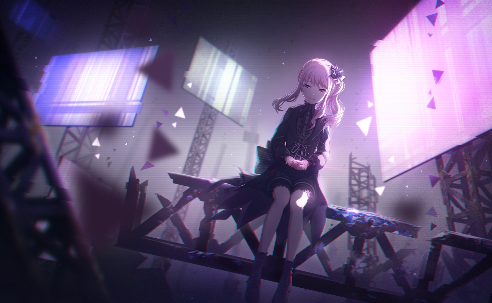

<h1 align="center">
  🌙 Luckless ☕️
</h1>

  <a href="https://github.com/KosoriDev">Kosori</a> | <a href="https://github.com/122o">122o</a>
   
  🇬🇧 | 🇺🇸 | 🇻🇳 | 🇩🇪 | 🇯🇵

## :book: Catalogue

- [:tea: About me ](#about-me)
- [:bar\_chart: Statistics ](#statistics)
- [:hammer: Technologies ](#technologies)
- [:video\_game: Gaming ](#gaming)
- [:mailbox: Contact ](#contact)

---

## :tea: About me <a id="about-me"/>

- My name is **Luckless** (aliases: **star122o**), and my pronouns are **she/them**
- I am currently a final year **student** at **[THCS Dịch Vọng Hậu](http://thcsdichvonghau.edu.vn/)** in **Hanoi, Vietnam**
- I am a full-stack **developer** with a focus on **web development** and **DevOps**
- I can code in **TypeScript**, **JavaScript**, **Python**, **Java**, **Kotlin** and **C#**.
- Else than coding, I enjoy **gaming** (especially **[Minecraft](https://minecraft.net)**, **[osu!](https://osu.ppy.sh)** and **[Project Sekai](https://colorfulstage.com)**)
- I love **[Mizuki Akiyama](https://colorfulstage.com/characters/nightcordat2500/mizuki/)** :sparkles: from **[Project Sekai](https://colorfulstage.com)**!

---

## :bar_chart: Statistics <a id="statistics"/>

 

---

## :hammer: Technologies <a id="technologies"/>

- **Operating System**:   

- **Languages**:        

- **Frameworks**:  

- **Databases**:  

- **Tools**:     

:warning: Some Icons doesn't appear, specifically Microsoft's Icon, is because of takedowns on SimpleIcons repository [here](https://github.com/simple-icons/simple-icons/issues/11236).

## :video_game: Gaming <a id="gaming"/>

- **Minecraft**:
  - [Lucklessly](https://mine.ly/Lucklessly) | [Skyblock Stats](https://sky.shiiyu.moe/stats/Lucklessly) | [Plancke](https://plancke.io/hypixel/player/stats/Lucklessly)
  - [NotChillingStar](https://mine.ly/NotChillingStar) | [Skyblock Stats](https://sky.shiiyu.moe/stats/NotChillingStar) | [Plancke](https://plancke.io/hypixel/player/stats/NotChillingStar)
- **osu!**: [osu!](https://osu.ppy.sh/users/35650471)
- **Project Sekai**: 57379171576979794564 (EN)
- **Steam**: [Luckless](https://steamcommunity.com/id/lucklessowo)

---

## :mailbox: Contact <a id="contact"/>

- **Discord**: [@lucklessowo](https://discord.com/users/1323167145479114834)
- **Twitter**: [@luckless122o](https://twitter.com/luckless122o)
- **TikTok**: [@luckless122o](https://tiktok.com/@luckless122o)
- **Telegram**: [@star122o](https://t.me/star122o)
- **YouTube**: [@ytstar122o](https://youtube.com/@ytstar122o)
- **Email**: [admin@luckless.de](mailto:admin@luckless.de)

---

## :wave: Thanks for visiting <a id="thanks-for-visiting"/>

- If you have any questions or just want to chat, feel free to reach out to me on any of the platforms above!
- Make sure to give me a follow on GitHub and check out my repositories!
- I appreciate your support and hope you have a great day! :sparkles:
- If you want to play games with me, feel free to add me on Discord or Steam!
- I often online on Discord, from 7 AM to 11:45 PM (UTC+7)

---

